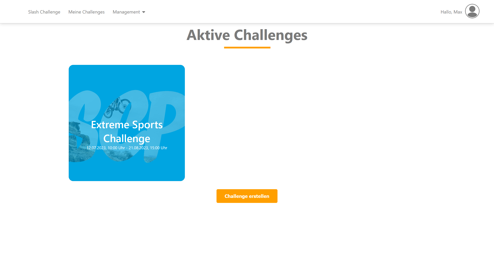
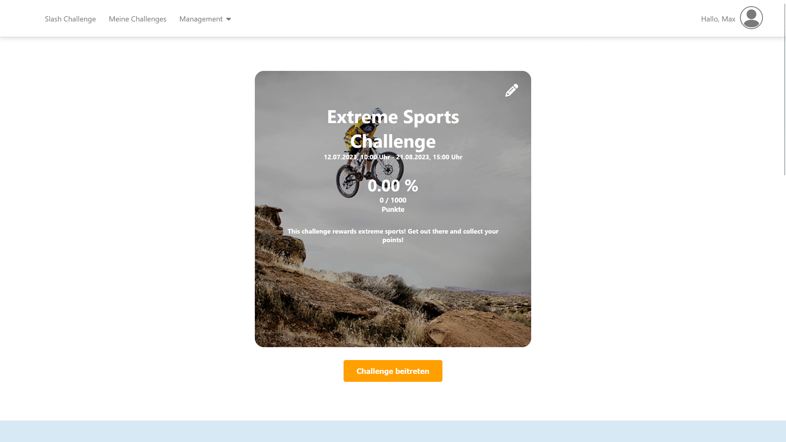
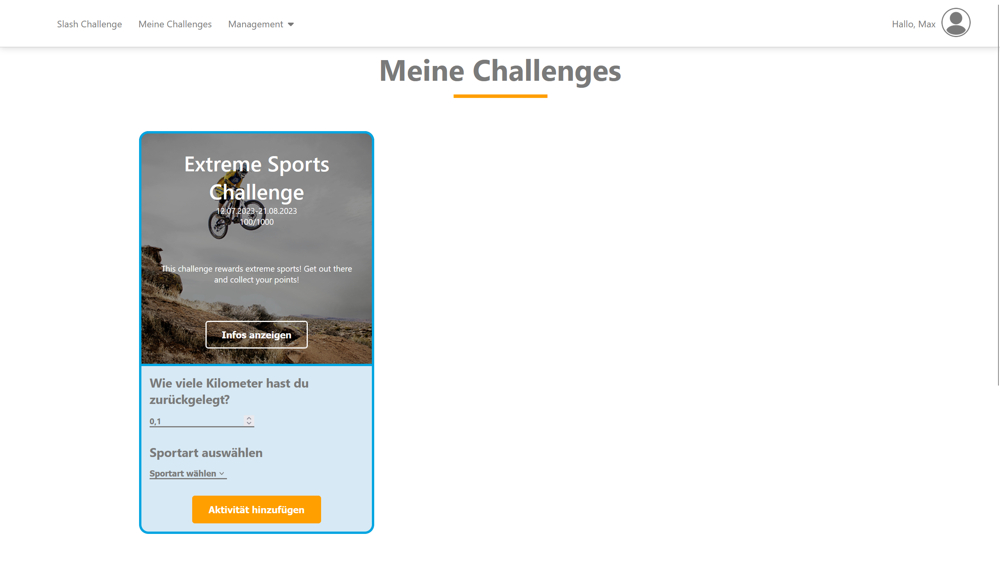

# Sport-Challenge-Project

**Important:** This repository acts as an archive of our work and we are thus not accepting any contributions. However, feel free to fork this repository and work on it on your own. Note that the frontend is kept in German.

The Sport-Challenge-Project was conducted as part of our fourth semester class "Projekt Softwaretechnik". It was created for and under the guidance of doubleSlash Net-Business GmbH. We were tasked with creating a web plattform for their internal "Sport-Challenge" program where employees can group up in teams and are rewarded for being active.

Our platform uses a three tier architecture. It authenticates users via SAML and allows them to create and manage Challenges, Sports and timed Bonuses, as well as documenting their Activities for a specific challenge. The app uses no form of authorization, thus any user is permitted to do any action.

It uses the following underlying technologies:
- React (Frontend)
- Spring Boot (Backend)
- PostgreSQL (Backend Database)
- Keycloak (SAML Provider - can be swapped out with any other correctly configured SAML provider)

For more information, take a look at the "Documentation.docx" file in the "Dokumente" subfolder (German!) or the "Meilenstein X.pdf" file in "Dokumente/Abgaben" for a .pdf version of the word file.

## Visuals

## Required
To run this project, you need to install the following dependencies:
- Docker
- At least Java version 17
- Apache Maven

## Installation
There are two ways to install this project.

### Automatic installation using Docker Compose
This approach uses a publicly available Docker image of version 1.0 of our project. This means that this approach only works if you want to use our final version.

Navigate to the "Dokumente/Abgaben" folder and open the "docker-compose.yml" file using a text editor of your choice.
If you just want everything to run locally, the only thing you need to change is the mail credentials in lines 23 to 26 respectively. 

If you want the app to be visible on the internet (not recommended!), you need to change line 21 to point to your public frontend server address, line 22 to point to the metadata address of your SAML provider, lines 18, 19, 36 and 37 to secure DB credentials and lines 73, 74, and 75 to point to your public backend server address. 

Remember that Keycloak needs to be configured to allow the app to connect using the "scp" entity-id and that SSL certificates are also required. For more information on this matter, refer to chapter 8.1.2 in the documentation.

Afterwards, just open any terminal application while in the folder mentioned earlier and type "docker compose up". After initialization and Keycloak setup, the frontend is available under port 3000, the backend is available under port 8081 and Keycloak is available under port 8080.

### Automatic compilation and containerization using a batch script (Windows only)
Open the "docker-compose-yml" file in the root of the project using a text editor of your choice. Update the mail credentials in lines 23 to 26.

If you want the app to be visible on the internet (again, not recommended!), follow the steps described in the Docker Compose chapter.

Run the "START.bat" file in the root of the project. This will build the backend and frontend locally from code and also build the docker containers. Afterwards everything is started. This approach comes with the added benefit of a pre-configured Keycloak instance. (Username/Password: admin/admin, Test account is max/123).

As with the Docker Compose installation approach, the frontend is available under port 3000, the backend is available under port 8081 and Keycloak is available under port 8080.

## Usage
After correct configuration of your SAML provider and user creation, open the frontend on port 3000 and log in. From there you can use the app as any other user would. You can test the backend by logging in at ":8081/login" and afterwards navigating to ":8081/swagger-ui.html".

## Authors and acknowledgment
The team consisted of the following members:
- Jason Patrick Duffy (Full-Stack-Developer, Scrum-Master, Team-, Backend- and DB-Lead)
- Robin Hackh (Full-Stack-Developer, Frontend- & UX-Lead)
- Tom Nguyen Dinh (Full-Stack-Developer, QA-Lead)
- Mason Schönherr (Full-Stack-Developer, Documentation-Lead, Group speaker)

We would like to thank our university supervisor Prof. Dr. rer. nat. Jörg Nitzsche and doubleSlash Net-Business GmbH for their forthcoming support whenever questions or issues arose.

## License
This project is available under MIT license.
